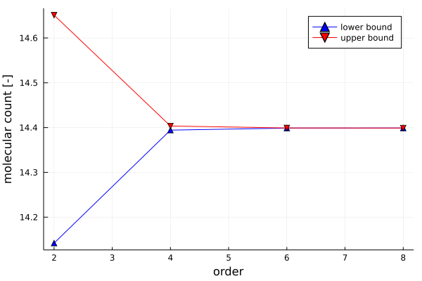
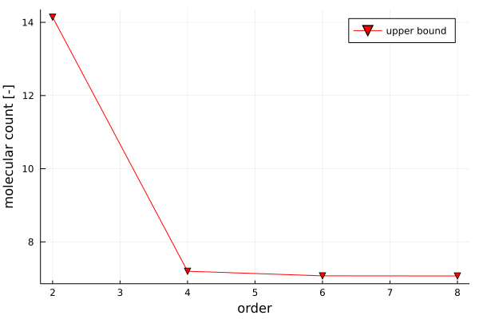
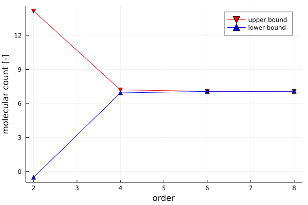
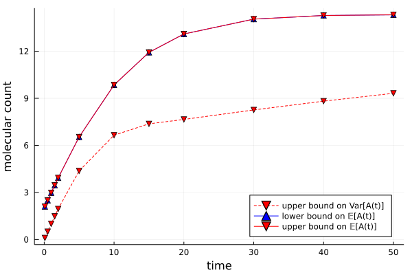

# Analysis of a Birth-Death Processes
In this example we wish to study the statistics of the simple nonlinear birth-death process

    ∅ → A
    2A → A

following mass-action kinetics. To define the underlying jump process it is convenient to utilize Catalyst.jl's functionality and simply define a reaction network with the above reactions.

```julia
birth_death = @reaction_network begin
    1.0, ∅ --> A
    0.01, 2A --> A
end
```

We will need to make reference to the species A in the network at several occasions. We therefore extract the symbolic variable using Catalyst.jl's species function.

```julia
A = species(birth_death)[1]
```

Throughout, we will further assume that the initial state of the process is known with deterministic certainty. The initial condition is supplied in form of a dictionary mapping the symbolic variable of all species in the process to their initial value. In this case, we assume that the initial count of species A is 2.

```julia
A0 = Dict(A => 2.0)
```

On a technical note, it shall also be emphasized that in biochemical applications it is very important to provide scales for the molecular counts of the different species in the system. Otherwise numerical instabilities will likely cause inaccurate solutions. The scales are provided in the same format as the initial conditions. The scales need not be accurate and can be obtained in many sensible ways, for example by looking at a single trajectory of the network or even at the deterministic rate-law model. For closed systems, MarkovBoundsSOS allows to compute scales based on the stoichiometry in the system.

```julia  
A_scale = Dict(A => 10.0)
```

With these pieces of input data, we can start analyzing the statistics of the stochastic reaction network/jump process.

For example, we can find upper and lower bounds on the mean count of species A with respect to the stationary distribution of the process. This can be
done by calling the function `stationary_mean` specifying the reaction network, the species of which bounds are sought, an order for the relaxation used for computing the bounds, an appropriate solver and (if desired) scales for the different species as inputs. In our case the reaction network is the birth-death network defined above and we care species A. The order of the relaxation used is left to the user to decide on a trade-off between computational cost and bound quality; the larger the order is chosen, the better the bounds become (in absence of numerical issues). It is generally advisable to start with low orders (2-6) and only go beyond these values if necessary as numerical instabilities become more pronounced issues at high orders. While any SDP solver supported by JuMP (https://jump.dev/JuMP.jl/stable/installation/#Supported-solvers) can be used, we recommend with sticking with the interior-point based solvers such as Mosek, SeDuMi, SDPA, or SDPT3. With all these pieces in place, the bounds can be computed by a simple function call:

```julia
mean_bounds = []
orders = [2, 4, 6, 8]
for relaxation_order in orders
    b = stationary_mean(birth_death, A, relaxation_order, Mosek.Optimizer, A_scale)
    push!(mean_bounds, b)
end
```


Similarly, we can compute an upper bound on the variance of the stationary
distribution of the process.

```julia
var_ub = []
orders = [2, 4, 6, 8]
for order in orders
    b = stationary_variance(birth_death, A, order, Mosek.Optimizer, A_scale)
    push!(var_ub, b)
end
```



While a lower bound of the variance can not be computed directly, we can use
the fact that we can compute bounds on the expecation of any polynomial of
the system state with respect to the stationary distribution. Accordingly,
we can simply compute a lower bound on 𝔼[A²] and combine this with the
previously computed upper bound on 𝔼[A] to find a valid lower bound
on the variance Var[A] = 𝔼[A²] - 𝔼[A]². To that end, we first transform
the reaction network into a ReactionProcess using the function
`reaction_process_setup`. This `ReactionProcess` features a jump process that is
equivalent to the reaction network, however, accounts for potential
reaction invariants and applies scales to the state. Moreover, the `ReactionProcess`
provides a map between the molecular species of the network on the states of
the jump process for easy interpretation of the results.

```julia
RP, x0 = reaction_process_setup(birth_death, A0, scales = A_scale)
```

Now we can compute a lower bound on Var(A)

```julia
var_lb = []
for order in orders
    b = stationary_polynomial(RP.JumpProcess, RP.species_to_state[A]^2, order, Mosek.Optimizer)
    push!(var_lb, b)
end
```



Everything presented above generalizes to the problem of bounding the expectation of moments and related statistics along at any finite time. For example, we can find lower and upper bounds on the mean molecular count of species A after 10 seconds:

    `transient_mean(birth_death, A0, A, 4, [10.0], Mosek.Optimizer, A_scale)`

These transient bounds can not only be improved by increasing the order of the relaxation but also by refining discretization of the temporal domain. This discretization is specified by providing an ordered list of time points in place of simply the time at which the bounds are to be evaluated. The last time point in this list refers to the time at which the bounds are evaluated.

This way, we can for example evaluate bounds on the trajectories of the mean and the variance of the molecular count of species A by computing bounds at different time points:

```julia
var_ub = []
mean_bounds = []
nT = 10 # number of intervals used to discretize the time domain
Ts = [0.1, 0.5, 1.0, 1.5, 2.0, 5.0, 10.0, 15.0, 20.0, 30.0, 40.0, 50.0]
for T in Ts
    trange = range(0, T, length=nT+1)
    b = transient_mean(birth_death, A0, A, 4, trange, Mosek.Optimizer, A_scale)
    push!(mean_bounds, b)
    b = transient_variance(birth_death, A0, A, 4, trange, Mosek.Optimizer, A_scale)
    push!(var_ub, b)
end
```
This way, we generate the following bounds on the moment trajectories of the process. 



For more detailes on the code used in this example, please review [this jupyter notebook](https://github.com/FHoltorf/MarkovBounds.jl/blob/master/tutorials/birth_death_process.ipynb).