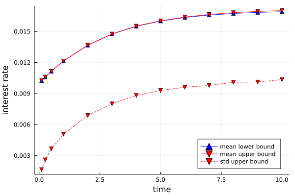

# Analysis of Cox-Ingersoll-Ross Model Modified by Jumps

Beyond jump processes modeling stochastic chemical systems, a much wider range of stochastic processes admits computable bounds on stationary and transient moments and related statistics via moment bounding schemes. Generally all jump-diffusion processes of the form
```math
    dx = f(x) \, dt + g(x) \, dW_t + \sum_{i=1}^n h_i(x) \, dN_{a_i(x),t}
```
can be analyzed as long as the data:
        ``f`` - drift coefficient
        ``gg^\top`` - diffusion matrix
        ``h_i`` - jumps
        ``a_i`` - arrival rates
are polynomials and the state space of the system is basic closed semialgebraic (i.e., described by finitely many polynomial inequalities) or can at least be reasonably well approximated by a basic closed semialgebraic set. In the following, we show with an example how to set the bounding problems up and compute relevant statistics.

Let us consider the simple Cox-Ingersoll-Ross (CIR) model for the dynamics of interest rates
```math  
    dx =  \kappa(\theta-x) \, dt + \sigma \sqrt{x} \, dW_t
```
As can be seen from the model this is a pure diffusion process. Such a process is defined as follows:

```julia
using MarkovBounds, Plots, MosekTools
κ, θ, σ = 0.15, 0.03, 0.05 # model parameters
@polyvar(x) # states (interest rate)
f = κ*(θ-x) # drift coefficient
g = σ^2*x   # diffusion matrix (outer product )
X = @set(x >= 0) # support/state space

cir = DiffusionProcess(x, f, g, X)
```

With the diffusion process defined, we can bound interesting quantities such as the long term average or variance of the interest rate ``x`` simply by calling

```julia
mean = stationary_mean(cir, x, 2, Mosek.Optimizer)
var = stationary_variance(cir, x, 2, Mosek.Optimizer)
```

The numerical results certify that the mean lies between 0.029999998 and 0.030000002 while the variance is upper bounded by 2.50006 × 10``^{-4}``. These results are of course in line with the analytical mean and variance of 0.03 and 2.5 × 10``^{-4}``.

Similarly, bounds along a trajectory can be evaluated with ease. In order to showcase how also jump-diffusion are dealt with, let us assume that the interest rate drops to half of its value at random times characterized by a Poisson process with rate a(x) = 0.035 x. To define this process, we can simply define the jump component separately as a jump process:

```julia
a = 10*x # arrival rate
h = x/2 # jump (interest rate jumps to half its value)
jumps = JumpProcess(x, a, h, X)
```

The overall jump-diffusion process is then defined in terms of the jump and diffusion process:
```julia
jumping_cir = JumpDiffusionProcess(jumps, cir)
```

Alternatively the process could also be defined in terms of the whole set of problem data:

    cir_jump = JumpDiffusionProcess(x, a, h, f, g, X)
    
Now we can for example study the evolution of means and variances of this process over time:

```julia
Ts = [0.1, 0.25, 0.5, 1.0, 2, 3, 4, 5, 6, 7, 8, 9, 10] # time points to probe mean and variance at
x0 = 0.01 # initial condition (deterministic - assumed)
order = 4 # relaxation order used
nT = 10 # number of time intervals used to discretize the time domain
μ0 = Dict(x^i => x0^i for i in 0:order+1) # moments of the initial distribution
var_bounds, mean_bounds = [], []
for T in Ts
    trange = range(0, T, length = nT + 1)
    mean = transient_mean(jumping_cir, μ0, x, order, trange, Mosek.Optimizer)
    push!(mean_bounds, mean)
    var = transient_variance(jumping_cir, μ0, x, order, trange, Mosek.Optimizer)
    push!(var_bounds, var)
end
```


In case we care more about long term predictions of the interest rate, we may wanna study the stationary mean and variance of the interest rate

```julia
mean = stationary_mean(jumping_cir, x, 4, Mosek.Optimizer)
var = stationary_variance(jumping_cir, x, 4, Mosek.Optimizer)
```
The numerical results certify that the mean lies between 0.0171291 and 0.0171799 while the variance is upper bounded by 9.2741 × 10``^{-5}``.

For more details on the code used in this example, please review [this jupyter notebook](https://github.com/FHoltorf/MarkovBounds.jl/blob/master/tutorials/jump_diffusion_process.ipynb).